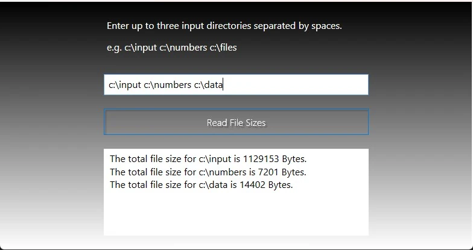

# thread-search

This project consists of a console app and a WPF app. Both apps recursively get the sizes of all files by using separate threads.




## Installation Instructions

1. Clone the repo:
```sh
git clone https://github.com/xiraynedev/thread-search.git
```

2. Open the cloned directory in **Visual Studio 2019** or later with **.NET 4.7.2** as the framework.