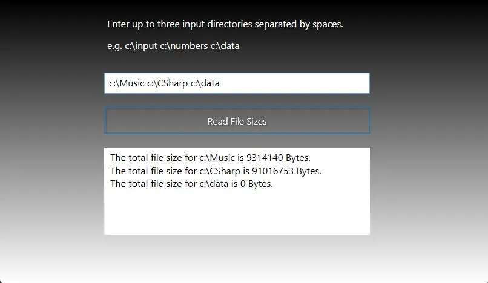

# thread-search

This application consists of a console app and a WPF app. Both apps recursively get the sizes of all files in the specified directories by using separate threads. The application was made using .NET 4.7.2 and Visual Studio 2019.




## Installation Instructions

1. Clone the repo:
```sh
git clone https://github.com/xiraynedev/thread-search.git
```

2. Change directory:
```sh
cd thread-search 
```

3. Open the solution file in **Visual Studio 2019** or later.